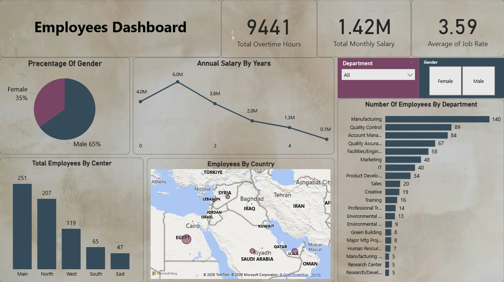

# **Employee & Workforce Strategic Dashboard (Power BI)**

### **Objective**
This dashboard transforms complex HR and payroll data into strategic insights. It enables leadership to monitor workforce costs, department-wise resource allocation, and regional distribution to improve operational efficiency.

### **Technical Implementation (Power BI Skills)**
* **Financial Modeling:** Analyzed total monthly payroll (**$1.42M**) and integrated overtime metrics (**9,441 hours**) to assess budgetary impact.
* **Geospatial Mapping:** Utilized interactive maps to visualize employee distribution across **Egypt, Saudi Arabia, Lebanon, UAE, and Syria**.
* **Demographic Analysis:** Built gender and department-specific visualizations to track diversity and workforce scaling.

### **Key Insights**
* **Payroll Efficiency:** Managing a significant monthly budget of **$1.42M**, with a deep dive into annual salary trends.
* **Manufacturing Strength:** The **Manufacturing department** is the largest workforce hub with **140 employees**, requiring the most resource management.
* **Overtime Monitoring:** Identified **9,441 overtime hours**, providing a clear KPI for operational cost control and staffing needs.
* **Regional Presence:** The geospatial analysis shows a strong centralized presence in Egypt with strategic expansion across the Middle East.

---
### **Dashboard Preview**

